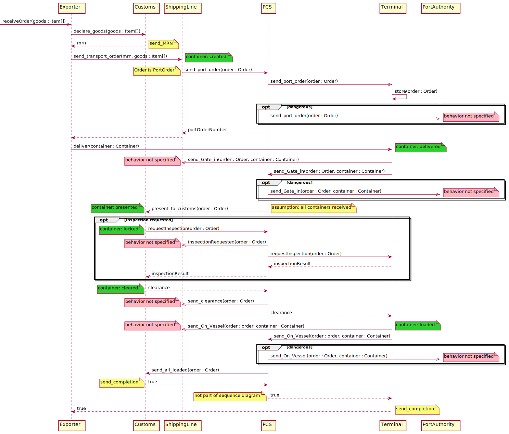
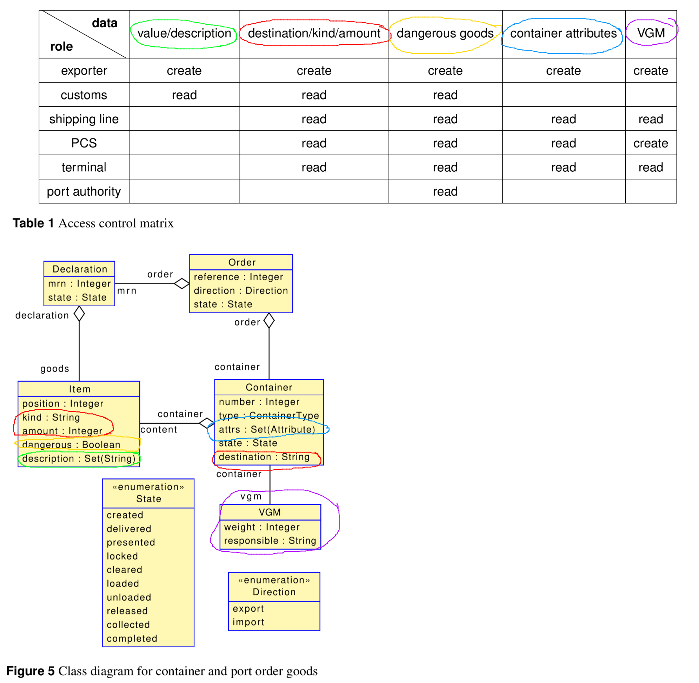
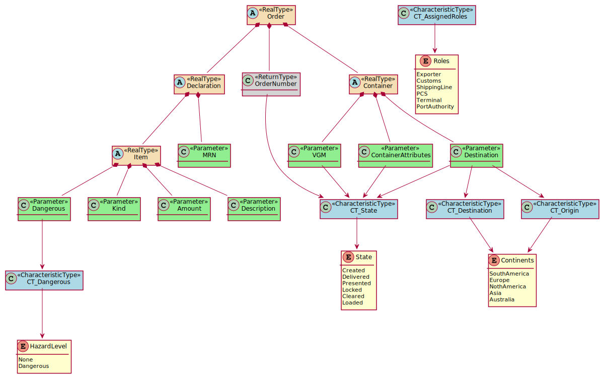

# Case Study Port Communication System

The case study is about a Port Communication System that mediates between different actors in shipping containers. The case study is based on [a publication](https://doi.org/10.5381/jot.2020.19.3.a8).

## Overview on Communication
The actors and exchanged messages between the actors are shown in the UML sequence diagram below. We adjusted the communication to meet limitations of the Palladio Component Model. Especially, it is not possible to call users in Palladio because all communication originates from users.

In the sequence diagram, the `Exporter` is a user. All other actors are system parts. We added notes to indicate changes or leave comments:
* Yellow: Gives information about original messages or changes with respect to the original publication.
* Green: Indicate if the status of a container changes at that particular position in the sequence diagram.
* Red: Indicate underspecified parts of the communication.

## Data Model
The publication describes the data model as shown in the figure below. Based on the data model, there are access control requirements given by an RBAC policy also shown in the figure below. Unfortunately, there is no perfect mapping between the RBAC policy and the data model because the `value` data type is missing. We assume that the `value` data type is part of the `Item`.

The sequence diagram does not use the data types specified in the RBAC policy but only refers to `Order` and `Container`. To simplify the mapping between the RBAC policy and the exchanged data, we replace `Order` and `Container` by the data types, which represent them. The figure given below illustrates our approach. Colored nodes have different meanings:
* Orange: Data types available in the sequence diagram (will be replaced)
* Green: Data types used in newly introduced parameters
* Blue: Metadata about the exchanged data
* Yellow: Value range of meta data

## Ideas for Exceptional Cases
* Port Authority can read only dangerous goods, but nothing more
* Fire
	* During a fire incident the port authority should know the content of all stored containers
	* e.g. avoid mixing of chemicals and chemical reactions or more explosions
* Customs
	* based on some factors the customs agency decides whether containers need to be physically controlled or whether they just provide the clearance
	* based on the origin country a container might always be controlled e.g. Columbia
* Drug Raid
	* During a drug raid the customs authority needs access to all container data
* Wrong classification of dangerous goods
	* Dangerous good might be wrongly classified
	* then depending on the scenario, the port authority might not get the dangerous goods or get too much information
	* wrong labeling might occur because of regulation changes, e.g. such as in the start port it was labeled as dangerous by the arrival time destination port, it isn't anymore
* Wrong execution order
	* e.g. a ship contains undeclared goods
